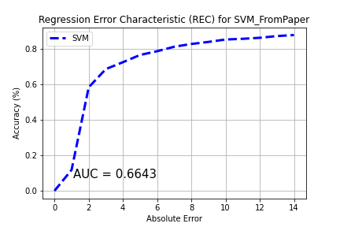

# Predicting forest fire size with weather data 

## Introduction

Fire size prediction is a great problem to apply machine learning to.  There are already many indicators which warn people about the forest fire risk at a given time/place, so it's natural to try to predict the size of any given forest fire based on those indicators.  This is a project that I made for a machine learning class in graduate school which attempts to fit a regression model to predict the size of a forest fire.  The task was to choose a problem and dataset off of Kaggle and write a machine learning model for it.  I chose this dataset because it is a self-described "hard" regression problem, and I thought I would enjoy trying it (I did), and that it would be a good learning experience (it was).  

This markdown file is a description of the project, the approach, the results of the project, and ways of changing the approach to make a more effective and useful model.

## Dataset Description, Robust Regression, and Zero Inflated-Regression

The dataset is the UCI Forest Fire Dataset, available <a href="url" target="https://archive.ics.uci.edu/ml/datasets/forest+fires">here</a>.  The dataset itself is a list of forest fires in a national park in Portgual.  It's built from merged two databases which contained separate fire attributes - one from a local fire inspector who recorded instances of fires and fire indicators, and the other from a local university which had a weather station in the center of the park.  

The 517 fires in the dataset each have 13 predictor variables.  They are X and Y coordinate for the location in the park, the month and day of the week the fires occured, the four variables from the FWI (Fire Weather Index), which is explained in detail <a href="url" target="https://www.nwcg.gov/publications/pms437/cffdrs/fire-weather-index-system">here</a>, and the weather conditions when the fire started.  

The response variable is measured in hectaacres, and provides the size of the fire that burnt.  Fires which burned less than one hectaacre (247 of them) were rounded down to 0.  This makes this problem an ideal fit for 0 inflated regression.

The ordered test set plot below sorts all of the fires by area and plots them:

The response variable clearly has exponential nature, meaning, these forest fires grow exponentially (like many others).  Additionally, there are many fires - about 47% - which burned less than one hectaacre and whose size was rounded down to 0.

The response data are zoomed in on different parts, for clarity:

Clearly, we need a regression model which both can accurately predict outliers to deal with the right side of the graph, and can handle zero-inflated data to deal with the left.  

There aren't any techniques which have both of those properties out of the box on their own (at least, to my knowledge), so we'll have to get creative.

## Overall Approach

The approach is going to take advantage of the fact that the dataset available is relatively small, and the CPU resources that are available are more than adequate to train a model relatively quickly.  

First, we'll decide on how we're going to measure the performance of the model.  Then, we'll look at the data to decide an overall modelling approach.  After that, we'll do a comprehensive grid search where over 700 individual models are trained in order to tune the hyperparameters in the best and most effecient way possible - producing over 700 models.  Each model will output the relevant performance metrics in individual folders, as well as one text file with model statistics which will be used to guide our search through outputted plots.  Finally, we'll analyze the results and recommend a path forward

## Measuring Model Performance

We will measure performance with these numeric metrics:

**AUC** :  AUC stands for "Area Under the Curve", where "The Curve" is the Regression Error Characteristic curve.  In this context, the X axis will be labeled with the absolute error (in hA), and the Y axis will be labeled with accuracy percentage.  A larger area under the curve implies greater accuracy for the model, however, the X axis is only extended to 15 ha for these runs.  Since the response variable is exponential, this limits the interpretation of it.

**MAD** :  MAD stands for "Mean Absolute Deviation", and is the average difference between each test point's actual fire value and its prediction.  It can give us a sense of how accurate the model is.

**RMSE** : RMSE stands for "Root Mean Squared Error", and is square root of the sum of the differences of the predictions and their actual values, each squared and divided by the number of samples.  It also gives us a sense of how accurate the model is, and is more sensitive to outliers than MAD.

We'll also look at plots which will tell us what the numeric metrics cannot.  Each model will output the Ordered Test Set, which will be each prediction/actual fire size pair, sorted by actual fire size, and then plotted similar to how they were above.  The prediction will be generated from each test-fold in the 10-fold cross validation (ie, all of the predictions plotted will be from each point's "turn" in the test set).  This will allow us to see how the model behaves both with the 0 samples and outliers in one visual.

We'll also look at the distribution of the response variable, since it provides another view into how the model behaves.

Finally, we'll use one similar to the best model from the paper which originally published this dataset as a baseline.

## Baseline performance - original model

The best model from the paper was Support Vector Regression with standardized features, and a `ln(x+1)` transformed response variable.  It also used pre-selected paramters `C` and `sigma`, while scanning for `gamma`.  

The authors found that only using the four weather features resulted in the best performance, while using the four weather features + four FWI indicators provided a close second.  The baseline model will be the one with the weather + FWI features, since the other models used will also use those 8 features.  

The performance of that model is described below:

AUC: 0.662 , MAD: 12.913 , RMSE: 64.559

While the REC Curve looks promising, the ordered test set shows almost all of the fires predicted are between 1 - 5 ha.  From looking at the distribution of the outputted response, we can see that no fire was predicted to be greater than 10 ha, and almost all were predicted to be less than 3 ha.

SVR is a technique which is known to be robust to outliers, but that isn't the case here.  While the AUC metric doesn't appear terrible, but misses the fact that the outliers on the right side of the graph are predicted incorrectly.  This makes it functionally useless.

The new approach will attempt to model both the 0-inflated-ness of the response, as well as the large-size outliers.

## Building an XGBoost Regressor with a Grid Search

### Tweedie Distributions and Choice of Loss Function

The choice to hone in on the tweedie loss function for a new model comes from a look at the distribution of the response variable.

We can see that when the response variable is transformed by `ln(x+1)`, it has a Tweedie distribution with parameter p between 1 and 2 (closer to 1, since it looks closer to Poisson).  

<a href="url" target="https://www.statisticshowto.com/tweedie-distribution/">Tweedie distributions</a>, when parameterized to represent a compound Poisson/Gaussian distribution, were first used in the auto insurance industry.  For a given policy, the expected number of claims was modelled to be distributed as a Poisson Random Variable, and the severity of each claim was distributed as a Gamma random varaiable.  This was used because the policy data was zero-inflated - there were many policy holders who did not get in car accidents and therefore had 0 losses, while others had at least 1 claim and had a randomly distributed cost of their loss.  Not only that, auto insurance loss distributions have extreme outliers called catastrophic losses which an insurance company would be interested in modelling.  This applies perfectly to the current response variable.  

Tweedie distributions were first used in GLMs, but also can be used as a loss function which will apply here.

### Transforming the response variable

Another natural step is to attempt different transformations for our response variable.  This was done because the tweedie distribution has several different shapes based on how the parameters are set.  

A parameter scan was conducted with these transformations:

1. Changing the bases of the 'log' functions by trying bases 2 and 10.
2. Applying an exponent of either 2/3, 1/2, or 1/3 to the data
3. Attempting both transformations, in different orders.

That scan resulted in trying these three transformations on the data:

1. The `ln(x+1)` transformation, described in the original forest fire paper.
2. The `log2(x+1)` transformation, since it left a slightly wider right skew than the original transformation.
3. The `sqrt(log2(x+1)` transformation, since it left the most normal looking distribution for the non-zero data.

The plots above show that the two log-only transformations have a tweedie distribution in the range of p=1.02-1.2, with a dispersion parameter between 1 and 2.  The resembelence can be seen below.

### Transforming the predictor variables

While not part of the grid search, It's also necessary to transform the predictor variables, in order to ensure the best possible result.  For this exercise, this included:

1. Dropping the X,Y, month, and day data.  The analysis from the original paper found they weren't useful, so they won't be included.
2. Reversing the rain and relative humidity parameters to be (6.4 - rain) and (100 - RH).  These new parameters were named 'antiRain' and 'Relative Dryness'.  This was done to make all predictors increase the likelihood of a fire as they increase.  This will make interpreting interaction terms and quadratic terms easier.
3. Another analysis on Kaggle found that that the ISI and FFMC variables were skewed, so they were both transformed with the `ln(x+1)` transformation.
4. All feature values had the `MinMaxScaler()` applied to them so they would all be between 0 and 1.  

Other analysises have made the case for throwing out outlier samples, both on certain predictors (particularly FFMC) and on the area of fire they consumed.  My view is that for a problem like this, that's not appropriate unless we have very clear subject-matter based reasons for doing it (we know that a fire was allowed to grow out of control for a non-weather reason like political disruption, we know an extreme weather event occurred during a particular time, etc.).  If outliers do disrupt too much, then I would use a technique like winsorization, or even feature binning.  

### Interaction and quadratic terms

In addition to the transformations above, an experiment with both the original features and interaction terms, and an experiment with original features, interaction terms, and quadratic terms were performed will be added to the grid search.

### XGBoost Tweedie Regression HyperParameters

XGBoost has a wide variety of hyperparameters, some of which were fixed for this, and some of which were scanned.  Below is a brief description of the hyperparameters used, and why they were set the way they were.

1. ***Fixed Parameters***:

`max_depth`: 5 - This parameter is tuned many times, however, based off of reading online literature and the relatively limited amount of features, it was assumed that 5 would be sufficent and scanning this parameter would not make a major change.

`num_boost_round`: 100 and `early_stopping_rounds`: 5  Taken together, these parameters are designed to make sure the algorithm boosts until the test loss stops going down, since the algorithm is expected to take many less than 100 boosting rounds.

`gamma`: 0.  Gamma is set to 0 because other regularization parameters are used (`min_child_weight` is a viable subsitute for `min_split_loss`, which is what `gamma` is).  

2. ***Searched Parameters***

`p`:  Scanned from 1.02, 1.07, 1.12, and 1.17 since visual inspections show the distribution of the response variable has a p-parameter within those values.

`eta`:  Scanned from 0.2 to 1 in 0.2 size incriments.  `eta` is a regularization parameter which shrinks feature weights to make the boosting process more conservative.

`min_child_weight`:  Scanned values are 2,4,6,8.  Number of data points in the training data needed in a new leaf to make that new leaf.  Substantially prevents overfitting.

## Summary of Experiments:

In total, a grid search was performed over these following possibilities / values:

For the XGBoost Model

1. 3 Input Matrices - One with the original features, one with the original features and cross terms between the features, and one with the original features, cross terms between the features, and quadratic terms for each feature.

2. 3 Response variable transformations - `ln(x+1)`, `log2(x+1)`, and `sqrt(log2(x+1))`.

3. 4 values of p

4. 5 Values of ETA.

5. 4 values of min_child_weight.

In addition, as a reference the SVM from the original paper was run on each iteration for the first two steps.  In total, the original SVM from the paper was trained, plus 6 experimental models, for 7 SVMs.  In addition, 720 XGBoost models were trained(3x3x4x3x5x4).  The output plots were subdivided between folders, and the code outputted one summary .txt document which contains the AUC, MAD, and RMSE for each model.

## Results:

First, the models which had the best increase in performance for the numerical metrics - AUC/MAD/RMSE - were SVMs.  They were the three SVMs which used the `sqrt(log2(x+1)` transformation.  The SVMs picked about the same ha value for each fire.  Given that the regularization parameters are reasonable, I don't believe that the model is over-regularized and thus underfit.  This also shows that the different interaction and quadratic terms did not have much of an impact, which we can see in the other trial runs as well.   

Next, the XGBoost models generally fell into 2 categories:
1. Models which were over-fitted / under-regularized had extreme outlier predictions, including some which predicted fires that were 0 ha to be over 1 million ha - meaning they predicted high outliers, but outliers that were way too high and for the wrong fires.  These models were generally under-regularized, with higher values of `eta`.  They are identifiable in the summary document by high values of MAD / RMSE.
2. Models which had fairly reasonable parameters to prevent over-fitting predicted many fires to be of size 0, and a substantial amount to be above 0 but less than 20.  However, most of the predictions of above 0 ha were not close to their true fire size.  An example is below for p=1.07, eta=0.2, and min_child_weight=2 with interaction terms, and log2 transformation.

In many cases, the output distribution of the response variable is somewhat similar to the actual distribution of the response variable even though most of the predictions are wrong.  For example, the log2 transformation below with p=1.12, eta=0.6, min_child_weight=4 and no interaction terms.

## Conclusions
	
	
The interaction and quadratic terms don't make the model any more accurate.  When the model is over-regularized, it predicts roughly the same size for every fire, which is close to 0ha.  As regularization is lessened, more predictions deviate from that same-value prediction, and more of those predictions are outliers.  However, those predictions are consistently wrong, and become more wrong as regularization is lessened.  There is no "sweet spot" where the model is consistently accurate.

My interpretation of the information above is that this model won't produce acceptable results.  However, given the other attempts to solve this problem online with various different models, including other outlier resistant regression models, it might be worth questioning how predictive these features are as a whole.  

Taking a look at the largest sample of a 1090 ha fire, its features look similar to those of a much smaller fire.  
X | Y | month | day	| FFMC | DMC | DC | ISI | temp | RH | wind | rain | area
| --- | --- | --- | --- |--- |--- |--- |--- |--- |--- |--- |--- | 
6 | 5 | sep | sat | 92.5 | 121.1 | 674.4 | 8.6 | 25.1 | 27 | 4 | 0 | 1090.84
4 | 4 | sep	| wed | 92.9 | 133.3 | 699.6 | 9.2 | 26.4 | 21 | 4.5 | 0 | 88.49

While that's a very ad-hoc analysis, taken with the information above, it may be that these features are non-predictive of forest fire size. (Note:  The reason I didn't do this type of analysis initially was because it was posted on kaggle, mentioned in a published paper, and the features themselves all seemed reasonably predictive of forest fire size).

## New approach = more useful model?

It may be possible to build a forest fire model.  First, adding more samples and more features might help.  Such features would include the response time of the fire department, how many other fires were ongoing at the start of the fire, how long the fire is believed to have been burning before the firefighters were able to respond, etc.

Another way to make a useful model would be to change the question being answered entirely.  Instead of attempting to predict the exact size, keep a running tally of all of these features taken every hour.  Then we can effectively treat these features as signals, and build a model which answers these types of questions.
    1.  Given the Weather / FWI data of the past N hours, as well as the date/time, what's the probability that at least one fire will start within the next M hours?
    2.  Given the Weather / FWI data of the past N hours, as well as the date/time, what's the probability that we will have a fire which can grow past X size within the next M hours?

Based on that, a Poisson/Gamma stochastic process model may be built, mapping a set of features X over N hours to the lambda, alpha, and beta parameters of a Poisson/Gamma model (Or use a Tweedie model and find p, mu, and phi - it's the same thing, but I find a Compound Poisson/Gamma distribution easier to reason with).  That way, we can predict the probability of 0 fires directly, as well as the probability of fires over a given size.  

Such a stochastic model with probabilistic responses may be appropriate given the random nature of the response variable.

## Final remarks

This concludes the description of the model that I built.  I hope that you enjoyed it, and please feel free to message me with any suggestions / ideas!
